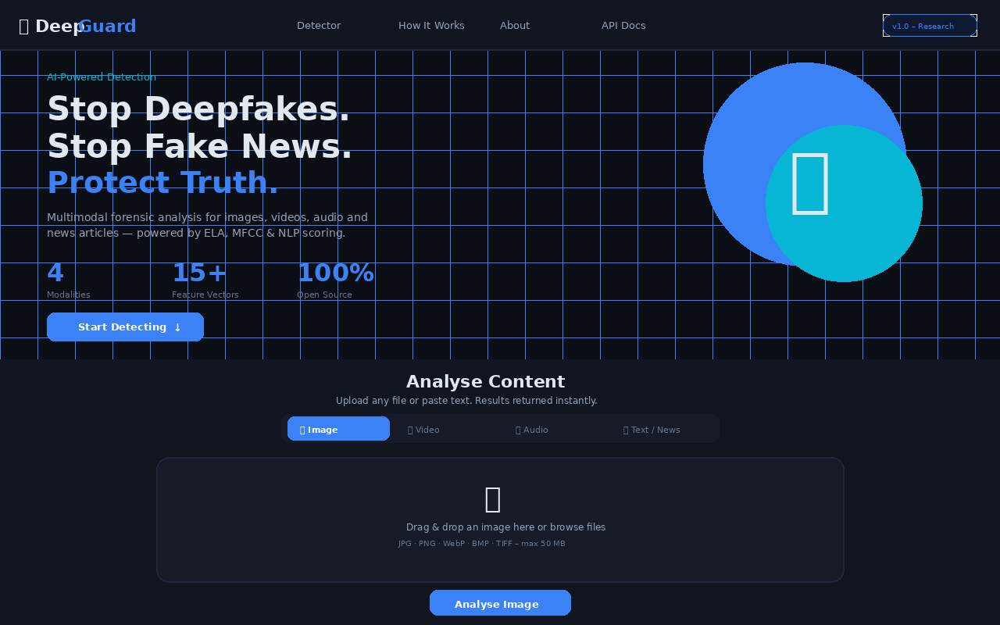
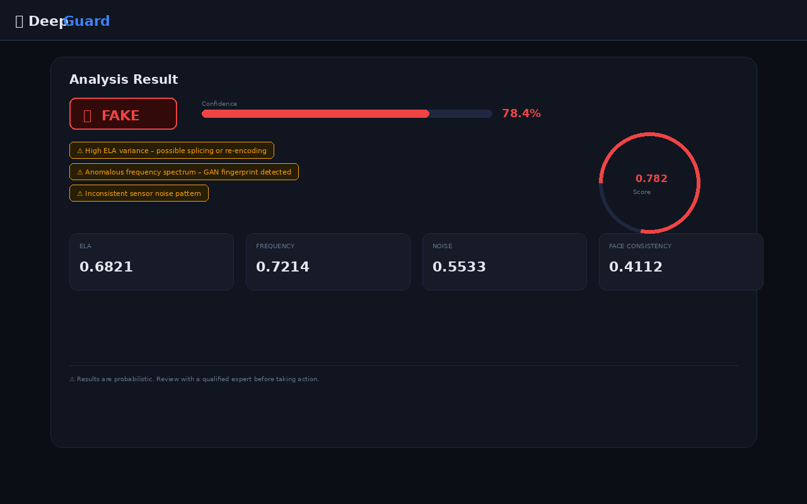
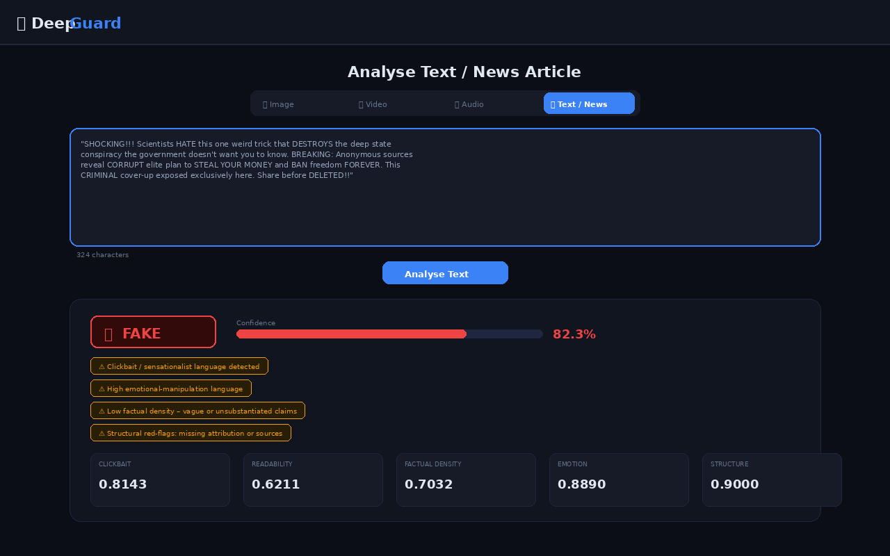
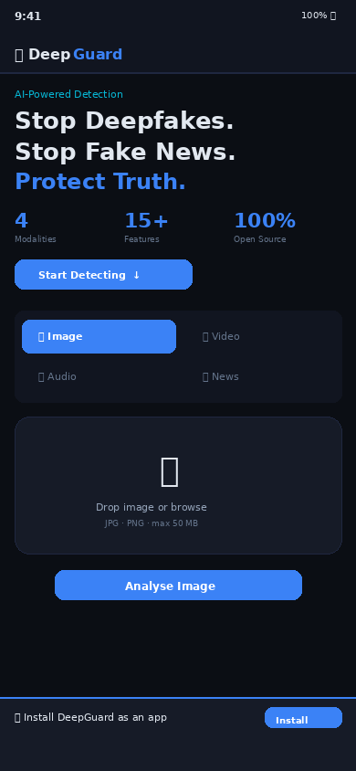

# 🛡️ DeepGuard — Multimodal Deepfake & Fake-News Detector

> **AI-powered forensic platform to stop digital fraud and fake news**  
> Detects deepfakes in **images, videos, audio** and identifies **fake news** in text — installable as a **Progressive Web App (PWA)** on any device.

---

## 📸 Screenshots

| Home / Hero | Result — FAKE Verdict |
|---|---|
|  |  |

| Text / News Analysis | Mobile PWA |
|---|---|
|  |  |

---

## 🔬 Research Paper

A comprehensive **20-page academic research paper** is included:  
📄 **[DeepGuard_Research_Paper.docx](DeepGuard_Research_Paper.docx)**

Covers: Abstract · Introduction · Background · Threat Landscape · System Architecture · Detection Methodologies · Implementation · Experimental Results · Discussion · Ethics · Conclusion · 24 References · 6 Appendices.

---

## 🎯 What It Detects

| Modality | Techniques | Threat |
|---|---|---|
| 🖼️ **Image** | ELA, DCT fingerprint, noise residual, face consistency | GAN portraits, spliced photos |
| 🎬 **Video** | Per-frame analysis, optical flow, blink rate, face ratio | Face-swap, lip-sync deepfakes |
| 🎙️ **Audio** | MFCC variance, spectral flatness, F0 consistency, silence ratio | Voice cloning, TTS fraud |
| 📰 **Text/News** | Clickbait score, readability, factual density, emotion, structure | Fake news, AI-written propaganda |

---

## 🚀 Quick Start

### 1. Clone & Install
```bash
git clone https://github.com/Ansh200618/DEEPFAKE
cd DEEPFAKE
pip install -r requirements.txt
```

### 2. Run the server
```bash
uvicorn app.main:app --reload --port 8000
```

### 3. Open the app
Visit **http://localhost:8000** — the PWA install prompt will appear.

---

## 📱 PWA Installation

Once the server is running, install DeepGuard as a native app:

- **Desktop (Chrome/Edge):** Click the `⊕` install icon in the address bar
- **Android:** Menu → *Add to Home Screen* / *Install App*
- **iOS Safari:** Share → *Add to Home Screen*

DeepGuard will appear in your system app launcher with its shield icon, running in standalone mode with offline support.

---

## 🔧 Permanent Installation (Linux Systemd)

```bash
sudo bash install.sh
```

This will:
- Create a `deepguard` system user
- Install dependencies in an isolated virtualenv at `/opt/deepguard`
- Register and start `deepguard.service` (auto-starts on boot)
- Open firewall port 8000 (if `ufw` is present)

```bash
# Status / control
systemctl status deepguard
systemctl stop   deepguard
systemctl start  deepguard

# Logs
tail -f /var/log/deepguard/access.log
tail -f /var/log/deepguard/error.log

# Uninstall
sudo bash uninstall.sh
```

---

## 🐳 Docker

```bash
docker build -t deepguard:latest .
docker run -d -p 8000:8000 --name deepguard deepguard:latest
# Or:
docker-compose up -d
```

---

## 🧪 Running Tests

```bash
pytest tests/ -v
```

**34 tests, 0 failures** across all detectors and API endpoints.

---

## 🔌 REST API

| Endpoint | Method | Description |
|---|---|---|
| `/api/health` | GET | Health check |
| `/api/detect/image` | POST | Analyse image (multipart) |
| `/api/detect/audio` | POST | Analyse audio (multipart) |
| `/api/detect/video` | POST | Analyse video (multipart) |
| `/api/detect/text` | POST | Analyse text (JSON) |
| `/api/docs` | GET | Swagger UI |
| `/api/redoc` | GET | ReDoc |

### Example
```bash
# Analyse an image
curl -X POST http://localhost:8000/api/detect/image \
  -F "file=@suspect.jpg"

# Analyse text
curl -X POST http://localhost:8000/api/detect/text \
  -H "Content-Type: application/json" \
  -d '{"text": "SHOCKING! Government hiding cancer cure — share before deleted!!"}'
```

### Response Schema
```json
{
  "label":      "FAKE",
  "confidence": 78.42,
  "score":      0.7842,
  "details": {
    "ela": 0.6821,
    "frequency": 0.7214,
    "noise": 0.5533,
    "face_consistency": 0.4112
  },
  "flags": [
    "High ELA variance – possible splicing or re-encoding",
    "Anomalous frequency spectrum – GAN fingerprint detected"
  ]
}
```

---

## 📁 Project Structure

```
DEEPFAKE/
├── app/
│   ├── main.py                    # FastAPI application
│   ├── detectors/
│   │   ├── image_detector.py      # ELA + DCT + noise + face analysis
│   │   ├── audio_detector.py      # MFCC + pitch + spectral analysis
│   │   ├── video_detector.py      # Optical flow + blink + per-frame
│   │   └── text_detector.py       # NLP fake-news scoring
│   ├── utils/
│   │   └── helpers.py             # DetectionResult, scoring utilities
│   └── static/
│       ├── index.html             # PWA web UI
│       ├── manifest.json          # PWA manifest
│       ├── sw.js                  # Service worker (offline + cache)
│       ├── offline.html           # Offline fallback page
│       ├── css/style.css          # Professional dark theme
│       ├── js/app.js              # Frontend logic + SW registration
│       └── icons/                 # All PWA icon sizes (72–512px)
├── tests/
│   ├── test_image_detector.py
│   ├── test_audio_detector.py
│   ├── test_video_detector.py
│   └── test_api.py
├── screenshots/                   # App screenshots
├── DeepGuard_Research_Paper.docx  # Full research paper (20 pages)
├── requirements.txt
├── Dockerfile
├── docker-compose.yml
├── deepguard.service              # Systemd unit file
├── install.sh                     # Permanent install script
└── uninstall.sh                   # Uninstall script
```

---

## ⚠️ Disclaimer

DeepGuard produces **probabilistic estimates**, not legal proof. All results should be reviewed by a qualified human expert before taking any action. The tool is intended for research, journalism, and awareness purposes.

---

## 📜 Licence

MIT — Free for research, education, and non-commercial use.
